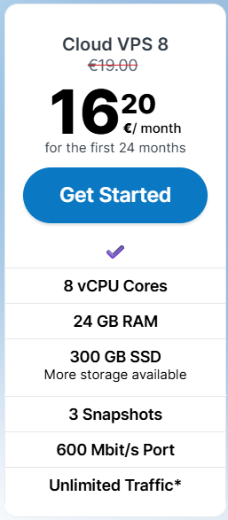
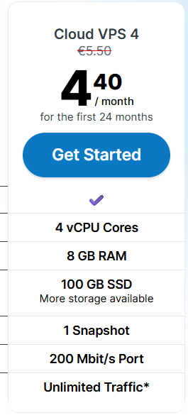
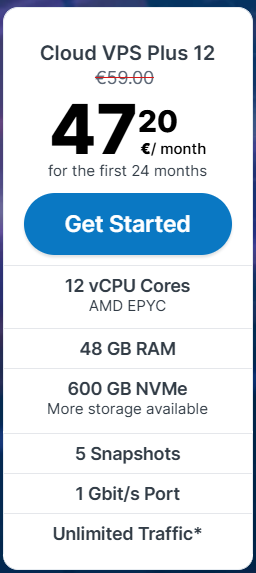

🖥️ Server 1: The Routing Engine (The Heavy Lifter)This server isolates OSRM or Valhalla. It handles real-time driver coordinates, path calculations, and dynamic passenger ETAs.Recommended Specifications:CPU: 8 vCPUs (Optimized for compute/high-frequency clock speeds)RAM: 32 GB RAM (RAM-Optimized instance)Storage: 80 GB NVMe SSDKey Features & Capabilities:In-Memory Performance: Loads the entire Bangladesh road network directly into RAM, enabling path lookups in under 5 milliseconds.Multi-Threaded Processing: Allocates separate CPU threads to process concurrent route updates from active drivers without queuing delays.Isolates CPU Spikes: High compute demands from drivers request-routing will never slow down map visual rendering or address searching.🔍 Server 2: Geocoding & Search Engine (The Data Indexer)This server runs Photon or Nominatim. It powers the search bar, auto-completing destination landmarks (e.g., "Bashundhara City", "Jatrabari Mor").Recommended Specifications:CPU: 4 vCPUs (General Purpose)RAM: 16 GB RAMStorage: 100 GB High-IOPS SSD (Fast read speeds are critical here)Key Features & Capabilities:Database Caching: Dedicates 12 GB of RAM exclusively to indexing local places, roads, and village coordinates for autocomplete features.Fuzzy Search Support: Handles misspelling variants natively in English and Bengali without causing performance bottlenecks.High Input/Output (IOPS): Optimized to perform rapid database read/write queries when thousands of riders are typing destinations simultaneously.🗺️ Server 3: Vector Tile Map Server (The Visual Renderer)This server runs TileServer-GL. It delivers the visual background map elements, street styling, and geographical boundaries to mobile screens.Recommended Specifications:CPU: 4 vCPUs (Standard)RAM: 8 GB RAMStorage: 50 GB NVMe SSDKey Features & Capabilities:Aggressive Edge Caching: Relies on high-speed NVMe storage to cache pre-rendered map blocks (tiles), minimizing recurring CPU usage.Low Memory Footprint: Vector maps are highly efficient; the server acts primarily as a file streamer rather than a calculation engine.Network Egress Stability: Isolated bandwidth routing ensures high-resolution map image delivery does not saturate the system data pipelines of your core routing backend.📊 Infrastructure Overview & Safety HeadroomServer Architecture ComponentSystem SoftwareTarget RAM (With 50-60% Headroom)Allocation PurposeServer 1: Routing EngineOSRM / Valhalla32 GB RAMHolds Bangladesh road matrix + handles driver pingsServer 2: Geocoding & SearchPhoton / Nominatim16 GB RAMPowers instant address search & autocompleteServer 3: Tile Vector MapTileServer-GL8 GB RAMStreams map images to rider/driver mobile appsTotal Production Stack56 GB RAMScalable, Crash-Resilient Architecture

https://contabo.com/en-us/vps-performance/

