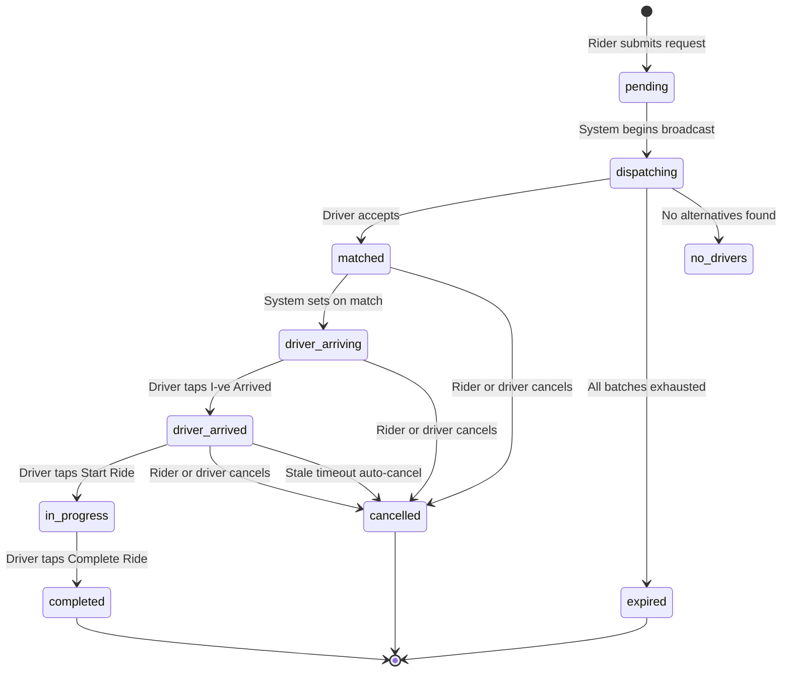
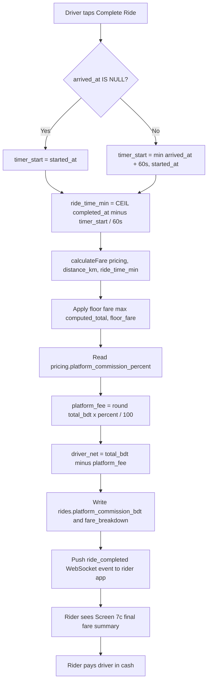

# Plan: Commission System + Waiting Time — Documentation Integration

> Integrates two new business capabilities into the existing 22-document Ride planning suite.
> No existing logic is broken. Cash-only payment, subscription model, heartbeat-gated call
> deduction, and driver-first pricing are all preserved.
> Zero-hardcoding principle enforced throughout: every new numeric value traces to a DB table.

---

## Scope Summary

### Capability 1 — Commission System
- New `platform_commission_percent numeric(5,2) NOT NULL DEFAULT 0.00` column on `pricing` table.
- New `platform_commission_bdt integer NULL` column on `rides` table (populated at ride completion).
- Fare breakdown API response gains three new fields: `platform_commission_percent`,
  `platform_commission_bdt`, `driver_net_bdt`.
- Admin pricing management screen allows editing commission percent per vehicle type.
- All "100% fare to driver" language softened to "fare minus any applicable platform commission
  (currently 0%)".
- Post-MVP collection note: deduction from driver call-wallet or subscription renewal.

### Capability 2 — Waiting Time Clarification & Implementation
- New ride status `driver_arrived` inserted into lifecycle between `driver_arriving` and `in_progress`.
- New `arrived_at timestamptz NULL` column on `rides` table.
- New `POST /api/ride/:id/arrive` endpoint (driver signals physical arrival at pickup).
- Fare recalculation at ride completion uses **actual** wait minutes
  (`CEIL(started_at − arrived_at)`), not the estimate.
- Updated `calculateFare()` in `lib/fareCalc.ts` — unified timer model (`ride_time_min` from timer start to completion).
- "I've Arrived" button added to driver Screen 7b (Driver Navigation to Pickup) in UI/UX spec.
- Final fare summary screen shown to rider before cash payment.
- Geofence auto-detection documented as post-MVP; manual button is MVP.
- All new thresholds (geofence radius = 100 m, dwell time = 30 s) stored in `system_config`.

---

## Files to Modify (14 files)

| # | File | Changes |
|---|------|---------|
| 1 | `01-PRD.md` | FR §30 trip states, fare formula, "100% fare" language, admin panel bullet |
| 2 | `02-ARCHITECTURE.md` | State machine, fare calc lifecycle, stale-arrived timeout, post-MVP commission note |
| 3 | `05-DATA-MODEL.md` | `pricing` + `rides` columns, `ride_status` enum, `system_config` seeds, `fare_breakdown` jsonb shape, `chat_messages` allowed statuses |
| 4 | `06-API.md` | New `POST /api/ride/:id/arrive`; update `POST /api/ride/:id/start` pre-condition; update `POST /api/ride/:id/complete` response; pricing PATCH schema |
| 5 | `07-USER-FLOWS.md` | Flow 4 Step 6 contradictory text removed; Steps N+1…N+6 added for waiting time |
| 6 | `08-UI-SPEC.md` | Screen 7b state-aware button swap + amber wait timer; new final fare summary screen |
| 7 | `09-UX-SPEC.md` | Micro-interactions for arrived state, final fare confirmation UX |
| 8 | `13-CONVENTIONS.md` | Two new conventions for commission calc and arrived_at sourcing |
| 9 | `14-DEV-CHECKLIST.yaml` | Two new task groups added |
| 10 | `14-DEV-CHECKLIST.json` | Mirror of yaml checklist |
| 11 | `19-GLOSSARY.md` | Five new terms |
| 12 | `21-MIGRATION-SQL.md` | ALTER TABLE SQL for new columns + seed updates |
| 13 | `22-TEST-TEMPLATES.md` | 11 new test cases across 3 groups |
| 14 | `20-DEVELOPER-CHANGE-LIST.md` | Change log entry |

---

## Detailed Task List

### Phase 1 — Data Model (`05-DATA-MODEL.md`)

- [ ] **DM-1** Add column to `pricing` table:
  ```
  platform_commission_percent | numeric(5,2) | NOT NULL | DEFAULT 0.00
  ```
  Description: Platform's share of final fare (%). DEFAULT 0.00 = zero commission.
  Admin-configurable per vehicle type per zone via admin panel.
  Add seed column value `0.00` to all 8 vehicle-type rows in the initial seed table.

- [ ] **DM-2** Add columns to `rides` table:
  ```
  arrived_at              | timestamptz NULL
  platform_commission_bdt | integer NULL
  ```
  `arrived_at`: When driver tapped "I've Arrived" (or auto-geofence). NULL until
  `driver_arrived` status is set.
  `platform_commission_bdt`: Commission charged to driver in paisa. Populated at ride
  completion from `pricing.platform_commission_percent` active at ride creation time.
  NULL until completed.

- [ ] **DM-3** Update `ride_status` enum — insert `driver_arrived` between `driver_arriving`
  and `in_progress`:
  ```
  'pending' | 'dispatching' | 'matched' | 'driver_arriving' | 'driver_arrived'
  | 'in_progress' | 'completed' | 'cancelled' | 'expired' | 'no_drivers'
  ```

- [ ] **DM-4** Add new rows to `system_config` seed table:
  ```
  geofence_arrival_radius_meters  = '100'   -- post-MVP auto-detection config
  geofence_arrival_dwell_seconds  = '30'    -- post-MVP auto-detection config
  stale_arrived_timeout_minutes   = '15'    -- auto-cancel if driver_arrived but never starts ride
  ```

- [ ] **DM-5** Update `fare_breakdown` jsonb shape note in `rides` table to include new fields:
  ```json
  {
    "base_fare_bdt": int,
    "distance_charge_bdt": int,
    "time_charge_bdt": int,
    "total_bdt": int,
    "floor_fare_bdt": int,
    "distance_km": number,
    "platform_commission_percent": number,
    "platform_commission_bdt": int | null,
    "driver_net_bdt": int | null
  }
  ```

- [ ] **DM-6** Update `chat_messages` table notes — allowed statuses list:
  Change from `('matched', 'driver_arriving', 'in_progress')`
  to `('matched', 'driver_arriving', 'driver_arrived', 'in_progress')`.

---

### Phase 2 — PRD (`01-PRD.md`)

- [ ] **PRD-1** Replace FR §30 "Trip States":
  - Remove: "No separate 'I've arrived' button — `driver_arriving` is set automatically when
    the driver accepts the offer."
  - Replace with: five-step lifecycle description:
    `matched` → `driver_arriving` (set automatically on match) →
    `driver_arrived` (driver taps "I've Arrived") →
    `in_progress` (driver taps "Start Ride") → `completed`.
  - Note that `driver_arrived` triggers the waiting timer.
    Manual button = MVP; auto-geofence = post-MVP.

- [ ] **PRD-2** Update fare calculation formula to add commission step:
  ```
  time_charge    = ride_time_min × per_min_bdt
  computed_total = base_fare_bdt + distance_charge + time_charge
  floor_fare     = base_fare_bdt + round(per_km_bdt × floor_length_km) + (floor_min × per_min_bdt)
  final_fare     = max(computed_total, floor_fare)
  platform_fee   = round(final_fare × platform_commission_percent / 100)
  driver_net     = final_fare − platform_fee
  ```
  State: "Rider pays `final_fare` to driver in cash. Driver owes platform `platform_fee`
  (tracked as liability; no automated collection in MVP)."

- [ ] **PRD-3** Soften all "100% fare to driver" language:
  - Problem statement: "keeping the fare minus any applicable platform commission
    (currently 0% by default)"
  - User table Driver row: "keeping the fare minus any applicable platform commission
    (currently 0%)"
  - Audit for any other occurrences and update consistently.

- [ ] **PRD-4** Update §16 / add §16a: "Actual wait time is measured from `arrived_at` to
  `started_at`. The rider is shown the actual fare on a final fare summary screen before
  paying cash."

- [ ] **PRD-5** Update §41 Admin Dashboard — Pricing & Zone Configuration bullet:
  Add "Set `platform_commission_percent` per vehicle type per zone (default 0.00%)."

---

### Phase 3 — Architecture (`02-ARCHITECTURE.md`)

- [ ] **ARCH-1** Update the ride lifecycle state machine diagram/table to include
  `driver_arrived`:
  ```
  matched → driver_arriving → driver_arrived → in_progress → completed
  ```
  Document transitions:
  - `driver_arriving → driver_arrived`: driver taps "I've Arrived" (MVP); OR auto-geofence
    within `geofence_arrival_radius_meters` for `geofence_arrival_dwell_seconds` (post-MVP).
  - `driver_arrived → in_progress`: driver taps "Start Ride". Sets `rides.started_at`.

- [ ] **ARCH-2** Update fare calculation lifecycle section:
- Add step: "At completion, compute `timer_start = min(arrived_at + 60_000, started_at)`; `ride_time_min = CEIL((completed_at − timer_start) / 60_000)`. Free wait is 60 seconds for all vehicle types."
- Add step: "Call `calculateFare(pricing, distance_km, ride_time_min)` — recomputes fare with actual ride time, applies floor fare."
- Add step: "Commission is derived:
  `platform_fee = round(total_bdt × pricing.platform_commission_percent / 100)`."
- Add step: "`rides.platform_commission_bdt` is written. Driver liability recorded for
  post-MVP collection."

- [ ] **ARCH-3** Document post-MVP commission collection mechanism:
  "Post-MVP: `platform_commission_bdt` will be aggregated per driver and deducted from their
  call-wallet balance or subtracted at subscription renewal. In MVP, admin can query total
  outstanding via
  `SELECT SUM(platform_commission_bdt) FROM rides WHERE driver_id=? AND status='completed'`."

- [ ] **ARCH-4** Add stale `driver_arrived` timeout alongside existing stale
  `driver_arriving` timeout:
  - If `rides.status = 'driver_arrived'` for longer than `stale_arrived_timeout_minutes`
    (from `system_config`, default 15 minutes) after `arrived_at` without progressing
    to `in_progress`:
    - `rides.status = 'cancelled'`, `cancelled_by = 'system'`,
      `cancel_reason = 'driver_no_show_after_arrival'`
    - Notify both rider and driver via WebSocket `ride:cancelled`.

---

### Phase 4 — API Contract (`06-API.md`)

- [ ] **API-1** Add new endpoint:
  ```
  POST /api/ride/:id/arrive
  Auth: driver
  Body: {} (empty — location confirmed by GPS at app layer)
  Pre-condition: ride.status = 'driver_arriving' AND ride.driver_id = requesting driver
  Action:
    - Set rides.status = 'driver_arrived', rides.arrived_at = now()
    - Push WebSocket event to rider: { type: 'driver_arrived', rideId }
  Response 200: { arrived_at: ISO timestamp }
  Errors:
    400 ride_not_in_arriving_status
    403 not_your_ride
    404 ride_not_found
  ```

- [ ] **API-2** Update `POST /api/ride/:id/start` (existing endpoint):
  - Pre-condition changes from `status = 'driver_arriving'`
    to `status = 'driver_arrived'`.
  - Error code changes to `400 ride_not_in_arrived_status`.
  - Document explicitly: "Driver must tap 'I've Arrived' (`POST /api/ride/:id/arrive`)
    before 'Start Ride' is valid."

- [ ] **API-3** Update `POST /api/ride/:id/complete` response to include final fare breakdown:
  ```json
  {
    "ride_id": "uuid",
    "total_bdt": 18000,
    "ride_time_min": 32,
    "platform_commission_percent": 0.00,
    "platform_commission_bdt": 0,
    "driver_net_bdt": 18000,
    "fare_breakdown": { }
  }
  ```
  Document the server logic:
  1. Compute `timer_start = min(arrived_at + 60_000, started_at)` (60s free wait —
     platform-wide constant from `system_config.max_free_wait_seconds`; whichever
     comes first). If `arrived_at IS NULL`: `timer_start = started_at`.
     Then `ride_time_min = CEIL((now() - timer_start) / 60_000)`.
  2. Call `calculateFare(pricing, distance_km, ride_time_min)`.
  3. Derive commission:
     `platform_fee = round(total_bdt × pricing.platform_commission_percent / 100)`.
  4. Write `rides.platform_commission_bdt`, `rides.completed_at`, `rides.status='completed'`,
     update `fare_breakdown` jsonb.
  5. Push final fare summary to rider via WebSocket:
     `{ type: 'ride_completed', totalBdt, rideTimeMin, commissionBdt,
     driverNetBdt, fareBreakdown }`.

- [ ] **API-4** Update `POST /api/admin/pricing` Zod schema:
  - Add `platform_commission_percent: z.number().min(0).max(100)` (optional on update).

- [ ] **API-5** Update fare estimate endpoint (`POST /api/ride/fare-estimate`):
  - Response includes `platform_commission_percent` (from pricing row).
  - Note: `platform_commission_bdt` is `null` until ride completion.

- [ ] **API-6** Update chat message endpoint validation to include `driver_arrived`
  in allowed statuses.

---

### Phase 5 — User Flows (`07-USER-FLOWS.md`)

- [ ] **FLOW-1** Fix Flow 4 Step 6 contradictory sentence:
  - Remove: "The driver then taps 'Start Ride' which transitions to `in_progress`."
  - Replace with: "The driver then taps 'I've Arrived' when at the pickup point (transitions
    to `driver_arrived`), then taps 'Start Ride' to begin the trip (transitions to
    `in_progress`)."

- [ ] **FLOW-2** Insert new steps after current Step 8 ("Driver navigates to pickup"):
  ```
  Step N:   Driver reaches pickup → taps "I've Arrived"
            → POST /api/ride/:id/arrive
            → rides.status = driver_arrived, arrived_at = now()
  Step N+1: Rider app receives driver_arrived WebSocket event
            → shows persistent "Your driver has arrived" banner
            → waiting timer visible to both parties
  Step N+2: Driver taps "Start Ride" (OR auto-start after 60s free wait expires)
            → POST /api/ride/:id/start
            → rides.status = in_progress, started_at = now()
            → Billable timer starts at min(arrived_at + 60_000, started_at)
            → After 60s, scheduler auto-sets started_at = arrived_at + 60s if driver hasn't started
  Step N+3: Ride completes → driver taps "Complete Ride"
            → POST /api/ride/:id/complete
            → final fare recalculated with actual wait minutes
            → commission derived from pricing.platform_commission_percent
  Step N+4: Rider receives ride_completed WebSocket event
            → final fare summary screen shown (actual wait + final fare)
  Step N+5: Rider pays driver exact final_fare amount in cash
  ```

- [ ] **FLOW-3** Document the `arrived_at IS NULL` edge case: if rider cancels while driver
  is en route (before `driver_arrived`), no actual waiting charge applies; commission not
  applicable.

---

### Phase 6 — UI/UX Specs (`08-UI-SPEC.md`, `09-UX-SPEC.md`)

- [ ] **UI-1** Update **Screen 7b: Driver Navigation to Pickup** to be status-aware:

  When `rides.status = 'driver_arriving'`:
  ```
  [Bottom card]
    "Navigating to pickup"
    [Pickup address]
    ETA: ~X min
    [Rider name + masked phone]
    [I'VE ARRIVED AT PICKUP — primary button, full width]
      → POST /api/ride/:id/arrive
  ```

  When `rides.status = 'driver_arrived'`:
  ```
  [Bottom card]
    "You have arrived"
    [Waiting timer — green upward counter MM:SS]
        turns amber after 60 seconds (platform-wide constant from system_config) to indicate chargeable time
    [START RIDE — primary button, full width]
      → POST /api/ride/:id/start
  ```

  Add both states to the Screen 7b States table.

- [ ] **UI-2** Add new **Screen 7c: Final Fare Summary (Rider)** — shown when
  `ride_completed` WebSocket event received:
  ```
  [@BottomSheet or full-screen modal]
    [Heading]: "Your ride is complete"
    [Fare breakdown table]
      Base fare:          ৳XX
      Distance charge:    ৳XX
      Actual wait (X min): ৳XX
      ─────────────────────
      Total fare:         ৳XX
      [Commission line — shown only if > 0%]
    [Final fare — large font]: "Pay ৳XX to driver"
    [CTA button]: "OK — Got it"
  ```

- [ ] **UX-1** Add micro-interaction: when rider app receives `driver_arrived` WebSocket event
  → show persistent banner "Your driver has arrived" with a pulsing icon. Banner dismisses
  when `in_progress` status received.

- [ ] **UX-2** Waiting timer UX note: driver sees green upward counter. After
  60 seconds (platform-wide constant from `system_config.max_free_wait_seconds`) the counter
  turns amber to indicate chargeable waiting has begun and the ride auto-transitions to
  `in_progress`. The 60-second value is read from `system_config` — never hardcoded.

---

### Phase 7 — Migration SQL (`21-MIGRATION-SQL.md`)

- [ ] **MIG-1** Add ALTER TABLE statements:
  ```sql
  -- pricing table
  ALTER TABLE pricing
    ADD COLUMN platform_commission_percent numeric(5,2) NOT NULL DEFAULT 0.00;

  -- rides table
  ALTER TABLE rides
    ADD COLUMN arrived_at timestamptz NULL,
    ADD COLUMN platform_commission_bdt integer NULL;

  -- ride_status enum (must run before any DML on the column)
  ALTER TYPE ride_status ADD VALUE 'driver_arrived' AFTER 'driver_arriving';
  ```

- [ ] **MIG-2** Add `system_config` seed inserts:
  ```sql
  INSERT INTO system_config (key, value) VALUES
    ('geofence_arrival_radius_meters', '100'),
    ('geofence_arrival_dwell_seconds', '30'),
    ('stale_arrived_timeout_minutes',  '15')
  ON CONFLICT (key) DO NOTHING;
  ```

---

### Phase 8 — Dev Checklist (`14-DEV-CHECKLIST.yaml` + `.json`)

- [ ] **CHK-1** Add task group "Commission System":
  - Add `platform_commission_percent` to `pricing` Drizzle schema
  - Add `platform_commission_bdt` to `rides` Drizzle schema
  - Update `lib/fareCalc.ts`: add commission derivation after `final_fare` calculation
  - Update `POST /api/ride/:id/complete` to compute and write commission
  - Update admin pricing PATCH endpoint Zod schema
  - Update fare breakdown response shape in all relevant endpoints

- [ ] **CHK-2** Add task group "Waiting Time / Driver Arrived":
  - Add `arrived_at` to `rides` Drizzle schema
  - Add `driver_arrived` to `ride_status` enum
  - Add `POST /api/ride/:id/arrive` route
  - Update `POST /api/ride/:id/start` pre-condition to `driver_arrived`
  - Update `lib/fareCalc.ts`: `calculateFare(pricing, distanceKm, rideTimeMin)` — unified timer, rideTimeMin=0 at estimate, actual at completion
  - Update `POST /api/ride/:id/complete` to use actual wait time
  - Add `system_config` seed rows for geofence and stale-arrived timeout constants
  - Driver app: Screen 7b state-aware button swap + amber wait timer
  - Rider app: `driver_arrived` WebSocket event handler + banner
  - Rider app: final fare summary screen (Screen 7c)
  - WebSocket server: add `driver_arrived` and `ride_completed` (with fare breakdown)
    event types to the event registry
  - Scheduler: add stale `driver_arrived` timeout auto-cancel job

---

### Phase 9 — Test Templates (`22-TEST-TEMPLATES.md`)

- [ ] **TEST-1** Commission calculation tests:
  - `commission_zero_default`: pricing row with 0.00% → `platform_commission_bdt = 0`,
    `driver_net_bdt = final_fare`
  - `commission_ten_percent`: pricing with 10.00% on ৳180 fare → commission = ৳18,
    driver_net = ৳162
  - `commission_applied_after_minimum_floor`: fare hits minimum floor first; commission is
    % of minimum_fare value, not raw total
  - `commission_null_until_complete`: `platform_commission_bdt IS NULL` while
    `status != 'completed'`

- [ ] **TEST-2** Actual waiting time tests:
  - `wait_within_free_window`: `arrived_at` to `started_at` = 90 s (< 2 min) →
    wait charge = 0
  - `wait_exceeds_free_window`: `arrived_at` to `started_at` = 3 m 10 s
    (CEIL = 4 min, free = 2) → chargeable = 2 min
  - `wait_null_arrived_at`: `arrived_at IS NULL` → use estimated wait from original
    breakdown
  - `wait_minimum_fare_floor_applied`: calculated fare with actual wait < minimum_fare →
    floor applied
  - `wait_driver_arrives_then_rider_cancels`: rider cancels after `driver_arrived` →
    `arrived_at` NOT NULL, no fare charged

- [ ] **TEST-3** State machine tests:
  - `status_driver_arrived_transition_valid`: `driver_arriving` → `driver_arrived` via
    arrive endpoint
  - `status_start_ride_requires_driver_arrived`: `POST /api/ride/:id/start` from
    `driver_arriving` returns `400 ride_not_in_arrived_status`
  - `arrive_endpoint_wrong_driver`: 403 if wrong driver calls arrive
  - `arrive_endpoint_wrong_status`: 400 if status != `driver_arriving`
  - `stale_arrived_auto_cancel`: scheduler cancels ride after `stale_arrived_timeout_minutes`
    elapses with no `in_progress` transition

---

### Phase 10 — Glossary (`19-GLOSSARY.md`)

- [ ] **GLOSS-1** Add entries:
  - `driver_arrived`: Ride status set when the driver physically reaches the pickup location
    and taps "I've Arrived" (or via auto-geofence — post-MVP). Sets `arrived_at` timestamp
    and starts the waiting timer.
  - `ride_time_min`: Billable minutes from timer start to completion.
    `timer_start = min(arrived_at + 60_000, started_at)` (60s free wait — platform-wide constant).
    `ride_time_min = CEIL((completed_at − timer_start) / 60_000)`.
    Falls back to `started_at` if `arrived_at IS NULL`.
  - `platform_commission_percent`: Admin-configurable commission rate (%) stored in `pricing`
    per vehicle type per zone. Default 0.00. The platform's share of the final fare, tracked
    as a driver liability.
  - `platform_commission_bdt`: Integer paisa value computed at ride completion as
    `round(final_fare × platform_commission_percent / 100)`. Stored on `rides`. NULL until
    completed.
  - `driver_net_bdt`: `total_bdt − platform_commission_bdt`. The amount the driver
    retains after commission. Equals `total_bdt` when commission is 0%.

---

### Phase 11 — Conventions + Change Log (`13-CONVENTIONS.md`, `20-DEVELOPER-CHANGE-LIST.md`)

- [ ] **CONV-1** Add convention: "Commission is always calculated as a percentage of
  `final_fare` (post-minimum-floor), never of the raw total. Commission functions receive
  all inputs as parameters; no constants are embedded."

- [ ] **CONV-2** Add convention: "The `arrived_at` timestamp is the canonical start of the
  waiting timer. All wait-time calculations use `arrived_at` from the `rides` table, never
  a client-supplied value."

- [ ] **CHANGE-1** Add entry to `20-DEVELOPER-CHANGE-LIST.md`:
  - Capabilities: Commission System (Capability 1) + Waiting Time Clarification
    (Capability 2)
  - Files modified: 01-PRD, 02-ARCHITECTURE, 05-DATA-MODEL, 06-API, 07-USER-FLOWS,
    08-UI-SPEC, 09-UX-SPEC, 13-CONVENTIONS, 14-DEV-CHECKLIST (yaml + json), 19-GLOSSARY,
    20-DEVELOPER-CHANGE-LIST, 21-MIGRATION-SQL, 22-TEST-TEMPLATES
  - Migration required: yes (ALTER TABLE + enum value + system_config seeds)

---

### Phase 12 — Gap Fixes

- [ ] **GAP-1** `POST /api/ride/:id/start` pre-condition (`06-API.md`):
  Pre-condition must change from `status = 'driver_arriving'` to `status = 'driver_arrived'`.
  Error code: `400 ride_not_in_arrived_status`. Add note: "Driver must call
  `POST /api/ride/:id/arrive` before Start Ride is valid." (Covered also in API-2 above.)

- [ ] **GAP-2** Stale `driver_arrived` timeout (`02-ARCHITECTURE.md`):
  Add alongside the existing `driver_arriving` stale-ride timeout: if `rides.status =
  'driver_arrived'` for longer than `stale_arrived_timeout_minutes` (from `system_config`,
  default 15 minutes) after `arrived_at` with no `in_progress` transition:
  auto-cancel with `cancelled_by = 'system'`, `cancel_reason = 'driver_no_show_after_arrival'`.
  Seed row added in MIG-2. (Covered also in ARCH-4 above.)

- [ ] **GAP-3** Screen 7b state-aware button swap (`08-UI-SPEC.md`):
  Screen 7b is the explicit target for the "I've Arrived" button. Button changes by status:
  `driver_arriving` → "I've Arrived at Pickup"; `driver_arrived` → wait timer + "Start Ride".
  Amber timer threshold is 60 seconds (platform-wide constant from `system_config.max_free_wait_seconds`,
  never hardcoded). After 60s, ride auto-transitions to `in_progress`. (Covered also in UI-1 above.)

- [ ] **GAP-4** `chat_messages` allowed statuses (`05-DATA-MODEL.md`):
  Add `driver_arrived` to the list so chat is not blocked during waiting.
  Same update in `06-API.md` chat message endpoint validation. (Covered in DM-6 + API-6.)

- [ ] **GAP-5** Flow 4 Step 6 contradictory text (`07-USER-FLOWS.md`):
  Remove the sentence "The driver then taps 'Start Ride' which transitions to `in_progress`."
  Replace with the correct two-step sequence. (Covered in FLOW-1 above.)

---

## Key Invariants to Preserve

| Invariant | How Preserved |
|-----------|--------------|
| Cash-only MVP | Commission is a liability record only; no digital deduction triggered |
| Subscription model unchanged | Commission columns are on `rides`, not `subscriptions` |
| Heartbeat-gated call deduction | No changes to dispatch or call deduction logic |
| Zero-hardcoding | `platform_commission_percent` in `pricing`; geofence + stale-timeout values in `system_config`; free wait minutes already in `pricing` |
| Driver-first pricing | Default commission = 0.00%; marketing language preserved with "currently 0%" qualifier |
| Minimum fare floor | Applied before commission derivation: `platform_fee = round(final_fare_after_floor × percent / 100)` |

---

## Mermaid: Updated Ride Status Lifecycle



---

## Mermaid: Commission + Final Fare Calculation Flow


